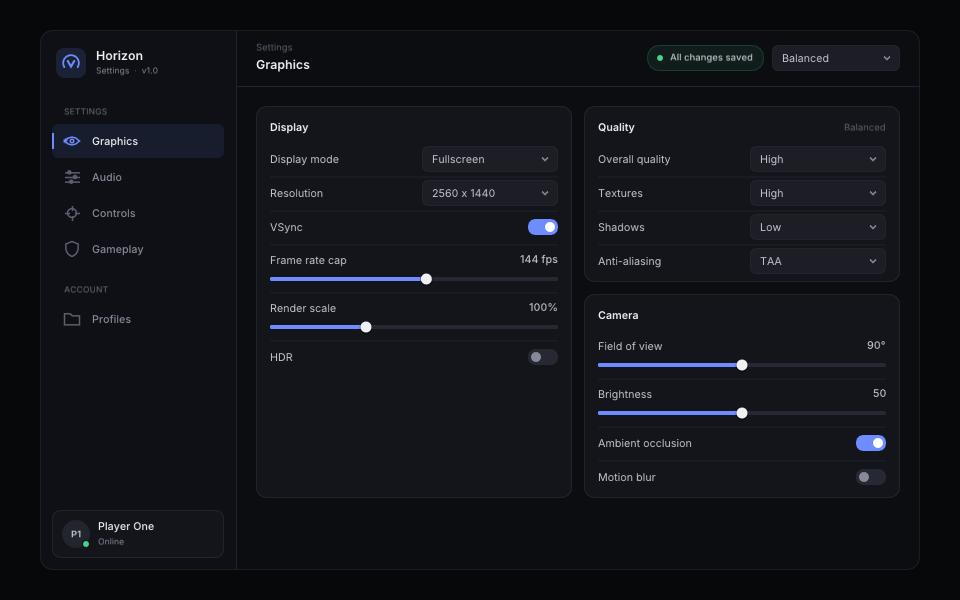
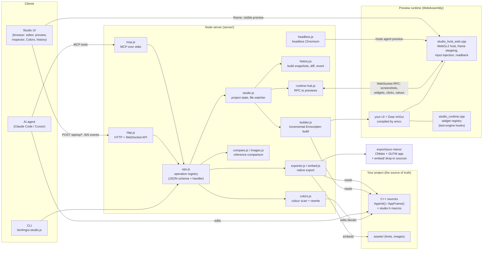

# ImGui Studio

**A visual feedback loop for AI agents building real Dear ImGui interfaces in C++.**

Created and maintained by **[OPTIC7409](https://github.com/OPTIC7409)**.

Agents are good at writing Dear ImGui code but blind to what it looks like, so
they settle for "default ImGui with new colours". ImGui Studio compiles the
actual C++ to WebAssembly, renders it through WebGL2, and gives the agent eyes
and hands: screenshots, widget inspection, scripted interaction, deterministic
animation filmstrips, reference-image comparison, build history, and export
back to a native project.


```
edit C++  ->  build_start (incremental, ~0.5-1 s)  ->  real Dear ImGui render (WASM + WebGL2)
   ^                                                            |
   |          inspect widgets / click / drag / hover / filmstrip / compare to reference
   +--------------------------------------------------------------+
                                  ...  ->  export_source  ->  native C++ (CMake + GLFW)
```

There is no HTML mock-up anywhere: every pixel comes from compiled Dear ImGui
code. The exported native build renders the same pixels as the preview
(SSIM 1.000, PSNR 56.8 dB between the WebGL2 preview and a GLFW + Mesa build of
the showcase project).

| Studio preview (WASM + WebGL2) | Exported native app (GLFW + OpenGL 3) |
|---|---|
|  |  |

## Quick start

Requirements: [Node 22+](https://nodejs.org) and Git. On Windows, also Python 3
(emsdk needs it to install itself). `npm run setup` installs the rest when it is missing:
[Emscripten](https://emscripten.org) (emsdk into `~/emsdk`, or `$EMSDK`), and a Chromium
for the headless agent preview (Chrome, Chromium or Edge are used when installed). It then
builds both example projects once, so the first start is fast.

```sh
git clone https://github.com/OPTIC7409/ImGuiStudio.git
cd ImGuiStudio
npm install
npm run setup          # Emscripten + browser if missing, then first builds
npm start              # Studio with the showcase project   -> http://localhost:7420
npm run resonance      # Studio with the agent-built menu   -> http://localhost:7421
npm run horizon        # Studio with the game settings menu -> http://localhost:7423
```

`npm start` copies the showcase template into `./workspace` (git-ignored) the first
time. `node bin/imgui-studio.js new my-menu` creates a project from a template
(`showcase` or `minimal`); open it with `serve --project my-menu`. `npm run doctor`
reports what the Studio found (Emscripten, browser, Claude Code).

After the first build, which compiles Dear ImGui once into a shared cache, only
changed files recompile. An edit to one file typically goes from save to a
reloaded preview and screenshot in 0.5-1 s.

### In Cursor

Open the folder in Cursor (`cursor .`). The repository includes Cursor configuration:

| File | What it does |
|---|---|
| [`.vscode/tasks.json`](.vscode/tasks.json) | **ImGui Studio: run everything** (default build task, Ctrl/Cmd+Shift+B) starts both Studios and opens them in your browser. It also runs when the folder opens once you allow automatic tasks. Other tasks: setup, tests, and the design agent (prompts for a brief). |
| [`.vscode/launch.json`](.vscode/launch.json) | F5 runs a Studio under the Node debugger |
| [`.cursor/mcp.json`](.cursor/mcp.json) | Gives Cursor's agent the `imgui-studio` tools (build, screenshot, inspect, click, compare, export) on `workspace/`. Enable the server under Cursor Settings > MCP. |
| [`.cursor/rules/imgui-menu-designer.mdc`](.cursor/rules/imgui-menu-designer.mdc) | Always-applied rule that loads the designer instructions and the full `imgui-premium-menu-design` skill into every Agent chat |

So in Cursor's Agent chat you can ask "Redesign the menu in workspace/ as a dark audio
plugin settings window" and it will edit the C++, build with `build_start`, look at the
real render and iterate, while you watch the Studio at http://localhost:7420.

### Examples

- [`examples/resonance`](examples/resonance): the settings window the design agent built on its own
  from a short brief (84 turns, 9 builds, about 12 minutes). Five pages: General, Audio,
  MIDI, Appearance, Shortcuts.
- [`examples/horizon`](examples/horizon): "Horizon", a game settings menu (Graphics, Audio,
  Controls, Gameplay, Profiles) built on a reusable `theme/` + `widgets/` layer. A good
  starting point to copy for your own menu.
- [`templates/showcase`](templates/showcase): "Nova", a hand-written custom settings UI.



## The ImGui Menu Designer agent

`imgui-studio agent` runs **Claude Code** headless as a menu designer, with the
[`imgui-premium-menu-design`](.claude/skills/imgui-premium-menu-design/SKILL.md)
skill **always loaded** and ImGui Studio as its only way to build and look:

```sh
node bin/imgui-studio.js agent "Design the settings window for an audio app: sidebar nav, \
  a preset selector, audio/MIDI/appearance pages" --new resonance --budget 5

node bin/imgui-studio.js agent "Recreate this menu" --project my-menu --reference target.png
```

How the skill stays in context for every run (never left to on-demand skill matching):

| Where the agent runs | How the skill is loaded |
|---|---|
| `imgui-studio agent` (headless) | Designer instructions + the full skill are passed with `--append-system-prompt-file`; for projects that already import it via CLAUDE.md, the import is used instead so it is never duplicated |
| `claude` inside a project created by `imgui-studio new` (or after `imgui-studio agent-kit`) | The project's `CLAUDE.md` `@imports` the designer instructions and the full skill at session start; `.mcp.json` configures the `imgui-studio` server |
| `claude --agent imgui-menu-designer` in this repo, or delegating to that subagent | [`.claude/agents/imgui-menu-designer.md`](.claude/agents/imgui-menu-designer.md) preloads the skill through its `skills:` frontmatter |

In a terminal, the command opens the Studio in your browser so you can watch every build,
and keeps it running after the agent finishes so you can click through the result (Ctrl+C
to stop; `--no-open` to skip the browser, `--exit` to quit when the agent is done). To look
at a project again later: `node bin/imgui-studio.js serve --project my-menu --open`.

The headless run uses `--strict-mcp-config` (only the Studio's MCP server),
`--tools Read,Edit,Write,Glob,Grep` (no shell: every build goes through
`build_start`), `--permission-mode acceptEdits`, and streams its progress; the
designer's narration also appears live in the Studio's **Agent** tab. Options:
`--model` (default `claude-opus-5-5`), `--effort` (default `high`), `--budget USD`,
`--max-turns N`, `--dry-run` (print the exact Claude Code command and files).
Transcripts are saved to `<project>/.studio/agent/run-*.jsonl`.

The designer's operating instructions live in [`agent/designer.md`](agent/designer.md):
the working loop (build, judge screenshots against the skill using measured
bounds, exercise every control, filmstrip animations, compare to references),
the finish criteria (the skill's section 29 checklist with capture evidence,
clean runtime errors, `export_check`, `export_source`), and boundaries. After
editing it, run `node bin/imgui-studio.js agent-kit --repo` to regenerate the subagent.

## Using the Studio from any MCP client

`imgui-studio mcp` is an MCP stdio server; it starts the Studio for the project
(or proxies to one already running), so you can watch the agent in the UI.

```sh
claude mcp add imgui-studio -- node /path/to/ImGuiStudio/bin/imgui-studio.js mcp --project /path/to/my-menu
```

This repository's [`.mcp.json`](.mcp.json) does the same for the default `workspace/` project.

### Tools

| Area | Tools |
|---|---|
| Project | `project_info`, `project_list_files`, `project_read_file`, `project_write_file`, `project_patch_file`, `project_delete_file`, `project_search` |
| Build | `build_start` (returns structured errors, or a screenshot + reference score), `build_status`, `build_errors`, `runtime_errors`, `preview_reload`, `preview_set_viewport` |
| Inspect & interact | `ui_list_widgets`, `ui_inspect_widget`, `ui_widget_at`, `ui_click_widget`, `ui_hover_widget`, `ui_mouse_leave`, `ui_drag_widget`, `ui_scroll`, `ui_set_value`, `ui_key`, `ui_type_text`, `ui_wait` |
| Capture | `capture_screen`, `capture_region`, `capture_widget`, `capture_window`, `capture_animation`, `captures_list` |
| Reference | `reference_load`, `reference_list`, `reference_set_active`, `reference_set_regions`, `reference_compare`, `reference_compare_region` |
| History | `history_list`, `history_diff`, `history_revert`, `history_note`, `history_compare_builds` |
| Export | `export_source`, `export_check` |

Interaction tools accept a semantic widget id (`graphics.vsync`), a unique label,
or `x`/`y` coordinates, and return the widget's state before and after. Pass
`capture: true` to get a screenshot back in the same call.

## Writing a project

A project is ordinary Dear ImGui C++ plus a `studio.json`:

```
my-menu/
  studio.json          # name, sources, include_dirs, viewport, background
  src/main.cpp         # AppInit() / AppFrame()
  src/menu.cpp         # composition
  widgets/*.cpp        # your ui:: control layer
  theme/*.cpp          # tokens, fonts, style
  assets/fonts/        # mounted into the preview; loaded with relative paths
```

The only contract is [`studio_app.h`](runtime/include/studio_app.h): `AppInit()` once
after the context and renderer exist, `AppFrame()` every frame between
`NewFrame()` and `Render()`. The same two calls drive the WebAssembly preview
and the exported native host, and they are all you need to embed the UI in an
existing application.

### Instrumentation (`studio.h`)

The Studio sees every Dear ImGui item automatically through Dear ImGui's
test-engine hooks (bounds, labels, hover/active, checked/open). The macros in
[`studio.h`](runtime/include/studio.h) add meaning and compile to nothing without
`IMGUI_STUDIO`, so instrumented code builds unchanged in native apps:

```cpp
bool ui::Toggle(const char* label, bool* v)
{
    ImGui::InvisibleButton(label, size);
    STUDIO_WIDGET("toggle");        // type for inspection
    STUDIO_BIND(v);                 // readable + settable with ui_set_value
    // ... animate with ImGui::GetIO().DeltaTime, draw with ImDrawList ...
    STUDIO_STATE("anim", t);        // shows up per frame in capture_animation
}

STUDIO_SCOPE("graphics");           // ids below become graphics.<label>
ui::Toggle("VSync", &s.vsync);      // -> "graphics.vsync"
```

Also: `STUDIO_ID("x.y")` (explicit id), `STUDIO_LABEL(label)` (for widgets built on
`ItemAdd`), `STUDIO_BIND_N / _COLOR / _TEXT`, and `STUDIO_REGION("sidebar", min, max)`
for panels that are not items.

### Determinism

The agent preview runs in a headless Chromium with SwiftShader WebGL2 and a
fixed 1/60 s timestep: time only advances when a command acts or waits, so the
same build and the same actions produce identical pixels on any machine. Drive
animations from `ImGui::GetIO().DeltaTime` / `ImGui::GetTime()`.

`capture_animation` performs an action at t = 0 and renders frames at exact
timestamps (sub-stepping at <= 1/60 s so exponential smoothing behaves as it
would live), returning a labelled filmstrip plus the widget's state per frame:


### Comparing with a reference

`reference_compare` returns a REFERENCE | CURRENT | DIFF composite and metrics:
similarity score, SSIM, pixel mismatch, colour (mean dE, matched palettes), edge
alignment, an estimated global layout offset, and hotspots annotated with the
widgets they overlap. `reference_compare_region` compares one mapped region (or
a widget's bounds) and reports its position/size delta. The Studio's Compare
view offers side-by-side, overlay, difference and swipe modes, region drawing,
and the live preview can overlay the reference directly.


## Studio UI

- **Left**: file tree and Monaco editor (Ctrl+S save, Ctrl+B build, error markers). Lines
  that create a widget in the preview get a gutter marker: click it to select the widget;
  the widgets on the cursor's line are highlighted in the preview.
- **Centre**: the live preview (the same WASM build, realtime), with viewport presets,
  zoom, HiDPI, pause/step/slow-motion, 8 px grid, reference overlay; and the Compare view.
  **Interact / Inspect** (Ctrl/Cmd+Shift+C): in Inspect mode hovering shows each widget's
  box, type, id and size plus its container; click selects, Shift+click or ↑/↓ walks out
  to containers, double-click (or Enter) opens the code that creates it, and hovering
  another widget measures the distance to the selection in pixels. In Interact mode, hold
  Alt (⌥) to do the same without switching. **▦** outlines every widget, region and child
  window.
- **Right**: widget inspector (live list; for the selection: position and size, spacing
  inside its container, a live editor for values bound with `STUDIO_BIND`, where it is
  created in the code, actions), the **Colors** panel, references
  and regions, visual build history (timeline, notes, diffs, compare, revert),
  captures, and the Agent activity log.
- **Bottom**: problems (structured diagnostics), streamed build output, runtime
  errors and logs (assertions with file:line, Dear ImGui error recovery messages).
- **Colors** (Figma-style): every colour literal in your sources (`Hex(0xRRGGBB)`,
  `ImVec4`, `ImColor`, `IM_COL32`), named by what it is assigned to (`C.bg_root`,
  `ImGuiCol_Text`, `kAccents[2]`). *Theme colors* edits one token; *All colors* groups
  identical colours so one edit recolours every use. The picker (saturation/value field,
  hue, opacity, hex, project swatches) rewrites the literal in its original notation and
  rebuilds, so the C++ stays the source of truth.
- "Agent drives preview" routes agent commands to your visible preview instead of
  the headless one, so you can watch every click.

## Export

`export_source` writes `export/<name>-build<N>/` (and a zip): your sources and
assets, `studio/studio.h`, Dear ImGui, `native/main.cpp` (GLFW + OpenGL 3 host)
and a `CMakeLists.txt` (uses system GLFW, or fetches it). `export_check`
compiles every source with the host compiler without `IMGUI_STUDIO` to prove
there is no Studio dependency.

To put the menu in an existing application, use the export's `embed/` folder:

- your `.cpp`/`.h` files flattened into one folder, with project `#include`s rewritten
  so no include paths are needed (a `main.cpp` becomes `src_main.cpp`)
- the `assets/` files compiled into `studio_assets.cpp`, with font/file loads routed
  through `StudioAssets`, so fonts load whatever the host's working directory is
- `studio.h` / `studio_app.h`, and a `CMakeLists.txt` that builds a `<name>_ui`
  static library against your `imgui` target

Add `embed/*.cpp` to any build that has `imgui.h` on the include path (or
`add_subdirectory(embed)`), then call `AppInit()` once and `AppFrame()` each frame.
The standalone build links the same `embed/` library.

```sh
cd export/my-menu-build12 && cmake -S . -B build && cmake --build build
```

## How it works



1. **Edit**: you (in the Studio editor or the Colors panel) or an agent (through MCP tools)
   change the C++ in your project. The project's sources are always the source of truth.
2. **Build**: `builder.js` compiles only the changed files with Emscripten into a WebAssembly
   module that contains your UI, Dear ImGui and the Studio host.
3. **Preview**: the module runs in the visible preview (an iframe in the Studio UI) and in a
   headless Chromium for agents. `studio_host_web.cpp` renders through WebGL2 and can step
   frames deterministically, inject input and read pixels back.
4. **Inspect and interact**: `studio_runtime.cpp` records every widget through Dear ImGui's
   test-engine hooks. Over WebSocket RPC (`runtime-hub.js`) the server lists widgets, clicks,
   drags, sets values, captures screenshots and animation filmstrips, and compares them with
   reference images.
5. **Iterate**: every build is snapshotted in the history (screenshot, diff, notes), so any
   iteration can be compared or reverted.
6. **Export**: `exporter.js` writes a standalone CMake + GLFW + OpenGL 3 app, plus `embed/`,
   flat drop-in sources with assets compiled in, for adding the menu to your own project.

Every capability is a single operation in `server/ops.js`. The Studio UI, the HTTP API,
the MCP tools and the CLI all call the same operations.

## Architecture

```
bin/imgui-studio.js      CLI: serve, mcp, agent, agent-kit, new, build, export, check, doctor
server/
  builder.js             incremental Emscripten builds (content-addressed object cache, depfiles, parallel)
  diagnostics.js         clang / wasm-ld output -> structured errors
  studio.js              project state: builds, history, captures, references, preview runtimes
  ops.js                 every capability as an operation (JSON schema + handler)
  mcp.js / http.js       MCP stdio adapter / HTTP + WebSocket API (localhost only)
  headless.js            headless Chromium hosting the deterministic agent preview
  runtime-hub.js         RPC to preview runtimes over WebSocket
  compare.js images.js   metrics, compositing, PNG/JPEG
  history.js textdiff.js snapshots, diff, revert
  exporter.js zip.js     native export + check
  colors.js              Colors panel: colour literal scan + in-place rewrite
  embed.js               drop-in embed/ sources (flat, assets compiled in)
  agent.js scaffold.js   Claude Code design agent, project templates + agent kit
runtime/
  include/studio.h       instrumentation macros (no-ops natively)
  src/studio_runtime.cpp widget registry on Dear ImGui's test-engine hooks
  src/studio_host_web.cpp WebGL2 host: frame stepping, input injection, pixel readback
  native/main.cpp        exported GLFW + OpenGL 3 host
web/                     Studio UI and the preview runtime page
agent/designer.md        the designer agent's instructions
.claude/                 the design skill and the designer subagent
.cursor/ .vscode/        Cursor: MCP server, always-on design rule, run tasks
scripts/setup.js         npm run setup (Emscripten, browser, first builds)
templates/               showcase ("Nova" custom settings UI) and minimal projects
examples/resonance/      the menu the design agent built
examples/horizon/        game settings menu example (theme + widgets layer)
third_party/imgui/       Dear ImGui v1.92.9b (see STUDIO_PATCHES.md)
```

## Tests

```sh
npm test    # unit + agent wiring + end-to-end (real Emscripten builds in headless Chromium)
```

End-to-end tests skip automatically when emcc or Chromium is unavailable.

## Author

ImGui Studio was created by **[OPTIC7409](https://github.com/OPTIC7409)**. If you use it
or build on it, please keep the copyright notice in [LICENSE](LICENSE) and credit the
project.

## Licences

MIT for ImGui Studio (Copyright (c) 2026 OPTIC7409). Dear ImGui is MIT (third_party/imgui/LICENSE.txt). The Inter
font bundled with the templates is under the SIL Open Font License
(templates/showcase/assets/fonts/Inter-LICENSE.txt).
